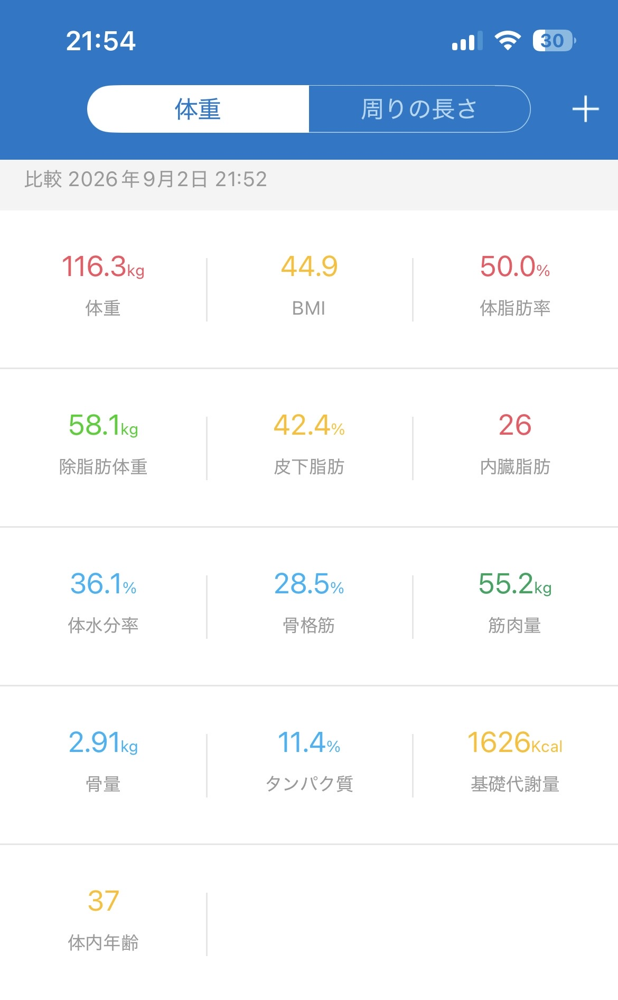

## なぜ断食を始めようと思ったのか

ファスティングや「16時間断食」という言葉が、過去に話題になりましたよね。

言葉自体は知っていましたが、正直なところ、これまで自分でやってみようとはあまり思っていませんでした。

そんな自分が断食をやってみようと思ったきっかけは、ある有名な芸能人が「1日1食」で生活しているという話を見たことでした。

「1日1食って実際どんな感じなんだろう？」

そこから少しずつ興味が出てきました。

いろいろ調べていくうちに、ファスティングや断食についてさらに気になり始め、せっかくなら自分でも試してみようと思うようになりました。

そこで今回は、1週間という期間を決めて、実際に断食をしてみることにしました。

この記事では、断食を始めるまでのことや、今回の実験のルール、開始時の体重などを記録していきます。

## 今回の断食ルール

今回の断食は、1週間を目標にします。

ただ何も口にしない完全な断食ではなく、今回は自分なりにルールを決めて実施します。

### 断食中のルール

- 期間：1週間
- 毎食：ソイプロテイン
- 昼：マルチビタミン
- 味噌汁：1日2食まで
- 体調が悪くなった場合は、その時点で中止

今回は「どこまで続けられるのか」を試すことが目的なので、無理をして続けるつもりはありません。

体調に異変を感じた場合は、すぐに中止します。

この1週間で、体重がどう変化するのか、空腹感はどのくらいあるのか、普段の生活にどんな変化があるのかも記録していきます。

## 断食開始時の体重

今回の断食を始める前に、体重と体脂肪率を測定しました。

- 体重：116.3kg
- 体脂肪率：50.0%

この数値をスタート地点として、1週間の断食でどのように変化するのか記録していきます。

体重だけではなく、その日の体調や空腹感なども含めて、できるだけ正直に記録していく予定です。

それでは、1週間の断食実験スタートです。

※この実験は個人による記録です。体調に不安がある場合や持病・服薬がある場合は、自己判断で断食を行わず、医療専門家に相談してください。
