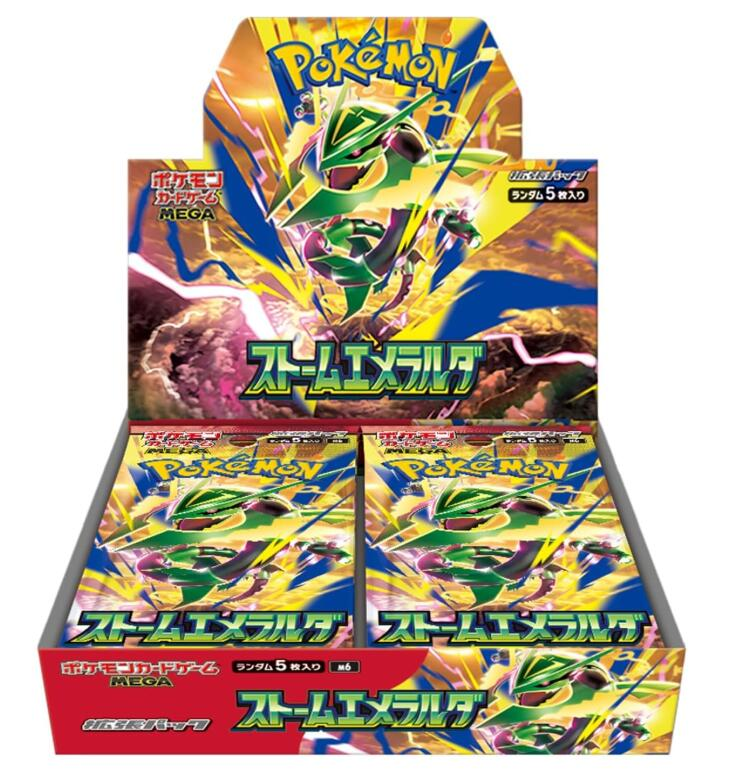

今回は、ちょっと嬉しかった出来事について書いてみようと思います。

なんと、イトーヨーカドーのポケモンカード「30th CELEBRATION」の抽選に当選しました！

ポケモンカードは人気が高く、新商品が発売されると抽選販売になることがあります。

今回も「当たったらラッキー」くらいの気持ちで応募していたのですが、結果を確認してみると……当選していました！

## **イトーヨーカドーの抽選に応募**

今回応募したのは、イトーヨーカドーで行われた「30th CELEBRATION」の抽選です。

30周年記念の商品ということもあり、かなり人気が出そうな商品です。

応募したときは、「まあ、当たったらラッキーかな」くらいに思っていました。

それだけに、当選を確認したときはかなり嬉しかったです。

## **ポケカの抽選ってどのくらい当たる？**

当選してから気になったのが、「イトーヨーカドーのポケモンカード抽選って、実際どのくらいの確率で当たるんだろう？」ということです。

今回の「30th CELEBRATION」については、応募者数や当選者数が公表されていないため、正確な当選率は分かりません。

ただ、過去のイトーヨーカドーの抽選を見ると、かなり狭き門だった例もあります。

参考になるのが、2026年7月に行われた**「ストームエメラルダ」**の抽選です。

一部店舗では、

- 赤池店：約1,500人中30人
- 知多店：約1,500人中28人

という例がありました。単純に計算すると、約2.0％、約1.9％となります。

つまり、こうしたケースでは100人応募して2人程度しか当たらない計算です。

ただし、これは「ストームエメラルダ」の過去の抽選結果です。今回の「30th CELEBRATION」の当選率ではありません。

今回については応募者数と当選者数が分からないため、「当選率○％だった」と断定することはできません。

## **それでも当選は嬉しい！**

正確な当選率は分かりませんが、人気のポケモンカード商品の抽選に当選できたのは素直に嬉しいです。

しかも今回は30周年記念の商品。ポケモンカードが好きなので、こういった記念商品を購入できるのは楽しみです。

抽選に応募して結果を待っている間は、「当たってくれ！」と思いながら、ちょっとしたワクワク感もありました。

そして実際に当選。こういう瞬間が抽選の面白いところですね。

## **あとは購入するだけ**

無事に当選したので、あとは購入期間などを確認して、忘れずに購入したいと思います。

せっかく当選したのに、購入期間を過ぎてしまったら悲しすぎます（笑）。

当選した商品が実際に手元に届いたら、そのときはまたブログで紹介したいと思います。

## **今後もポケカの抽選に参加したい**

今回「30th CELEBRATION」に当選したので、今後も欲しいポケモンカードが抽選販売されるときは応募してみようと思います。

もちろん、毎回当たるわけではありません。むしろ外れることのほうが多いと思います。

それでも、応募して結果を待つ時間も含めて楽しめるのがポケモンカードの面白いところだと思っています。

今回は久しぶりに嬉しい当選だったので、自分の記録としてブログに残しておくことにしました。

次は何のポケカ抽選に当たるのか。また嬉しい結果が出たら記事にしたいと思います。

「30th CELEBRATION」、無事に購入してきたいと思います！
